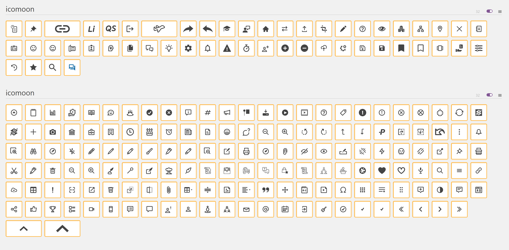
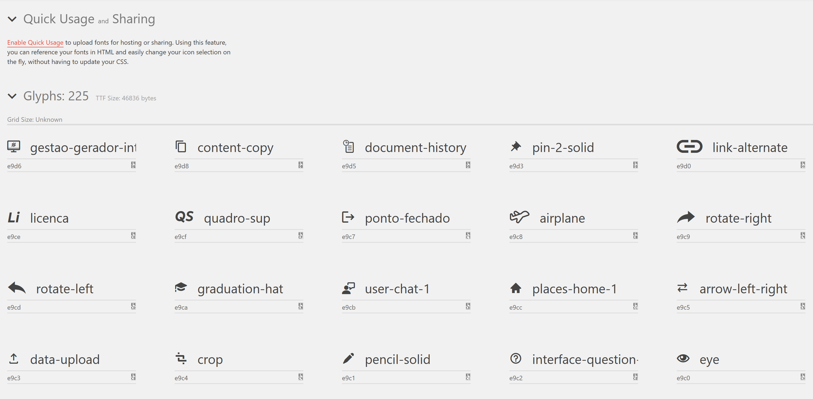
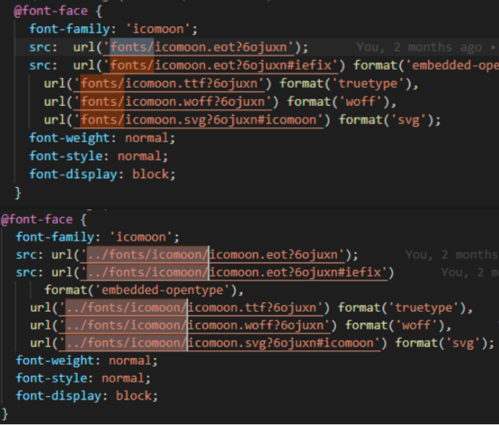

# Artemis

## Ícones

### Introdução:

Este guia detalhado irá te auxiliar passo a passo no processo de adicionar ícones ao projeto Artemis. Siga cada etapa com atenção para garantir um resultado preciso e evitar erros.

**_Considerações iniciais_**

- **Comunicação com o time:** Fazer a inclusão dos ícones necessários na sua feature. Informe o time, qualquer inclusão de um novo ícone dependerá da sua branch.
- **Verificação de ícones existentes:** No passo 1, item 4, observe se esse icone já existe dentro do projeto, o mesmo estará selecionado com bordas amarelas.

### Passos para Adicionar Ícones:

##### 1. Importar os ícones já existentes no projeto:

- 1. **Localizar arquivos SVG:** Encontre os arquivos .SVG do ícones que você deseja adicionar
- 2. **Acessar IcoMoon:** https://icomoon.io/app/#/select (recomendação: use a janela anômima)
- 3. **Importar ícones:** Selecione Import Icons
- 4. **Confirmar importação:** Adicione o arquivo selection.json (ibb-artemis\src\assets\icomoon\selection.json)
- 5. **Importar novos ícones:** Clicar em YES no popup (caso houver)
     **_Obs:_** Todos os ícones que já pertencem ao projeto vão ser inclusos e já vão estar selecionados (bordar amarelas)
     

- 6. **Gerar fonte:** Selecione Import Icons e adicione os icones .svg que você quer adicionar ao projeto
- 7. **Baixar arquivos:** Clique em Generate Font
     **_Obs:_** Não altere o nome dos ícones (Ex: logo-bb), pois deixará de funcionar ícones já utilizados no projeto.
     
- 8. **Finalize o primeiro processo:** Clique em Download

##### 2. Adicionar o Zip ao Projeto:

**_Obs:_** Atenção aos caminhos de pastas.

- 1. **Acessar pasta assets:** Acesse (ibb-artemis\src\assets\) do frontend
- 2. **Excluir pasta icomoon:** Delete a pasta icomoon
- 3. **Extrair zip:** Extraia o zip baixado, copie a pasta icomoon (do zip) em (ibb-artemis\src\assets\)
- 4. **Substituir arquivos de fonte:** Acesse (ibb-artemis\src\assets\fonts\icomoon) apague os 4 arquivos de fontes. Em seguida acesse ibb-artemis\src\assets\icomoon\fonts copie os 4 arquivos de fontes e cole na pasta anterior (ibb-artemis\src\assets\fonts\icomoon).
- 5. **Alterar caminho das fontes:** Abra o arquivo ibb-artemis\src\assets\icomoon\style.css
- 6. Copie todo arquivo.
- 7. Abra o arquivo ibb-artemis\src\assets\css\artemis-icons.css.
- 8. Apague tudo e cole o arquivo style.css.
- 9. Altere o caminho dos arquivos conforme a imagem abaixo.
- 10. **Excluir:** Manter apenas o arquivo selection.json dentro da pasta (ibb-artemis\src\assets\fonts\icomoon).

**_Alterar de fonts/ para ../fonts/icomoon/_**

##### Finalização:

- Salve as alterações.
- Derrubar e subir novamente o frontend.

##### Recursos Adicionais:

Guia de Estilo Artemis: https://teams.microsoft.com/_#/apps/com.microsoft.teamspace.tab.wiki/sections/recent-wikis?tabId=tab::b43decf9-2cc0-4b0c-81ad-818fd546327a&threadId=19:982eb85c3acc4a84a62e05ceb5fbdd7d@thread.tacv2
